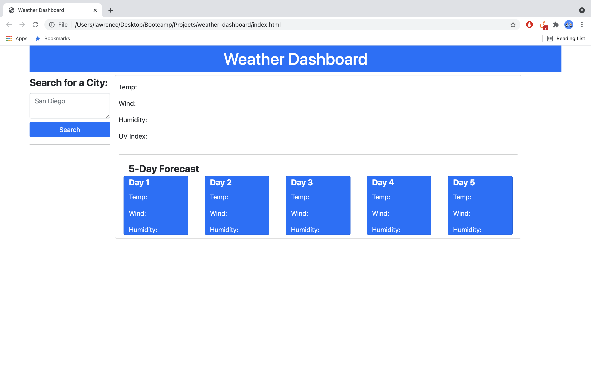
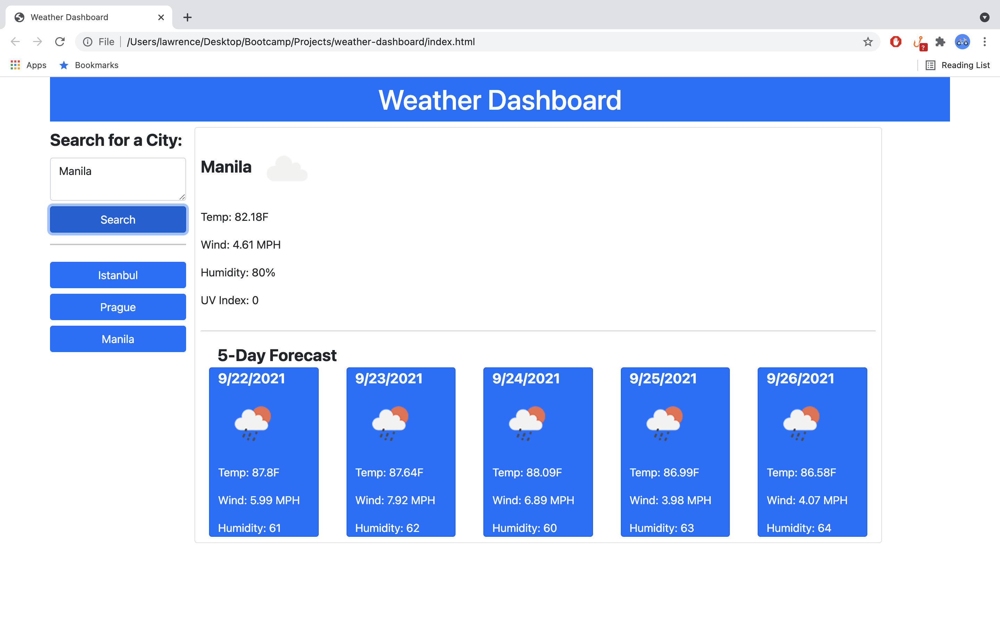

# Weather Dashboard

This is the module 6 assigment for the GW Coding Bootcamp Course submitted by Lawrence Rivales.

This is a weather dashboard app.  It can be reached at https://lrivales.github.io/weather-dashboard/

## Usage
1. Type a valid city name and click search.
2. The top right pane will show the current weather for the location.
3. The bottom right pane will show the weather for the next five days for that same location.
4. A 'history' button gets added on the bottom left pane.
5. Each search creates a new 'history' button.
6. Clicking on the 'history' button updates the weather information on the right pane.
7. Reopening the browser will restore the 'history' buttons as long as the user does not clear their browser cache.

## Snapshots

